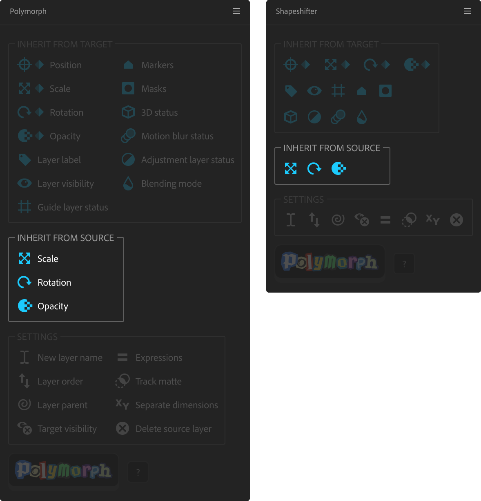
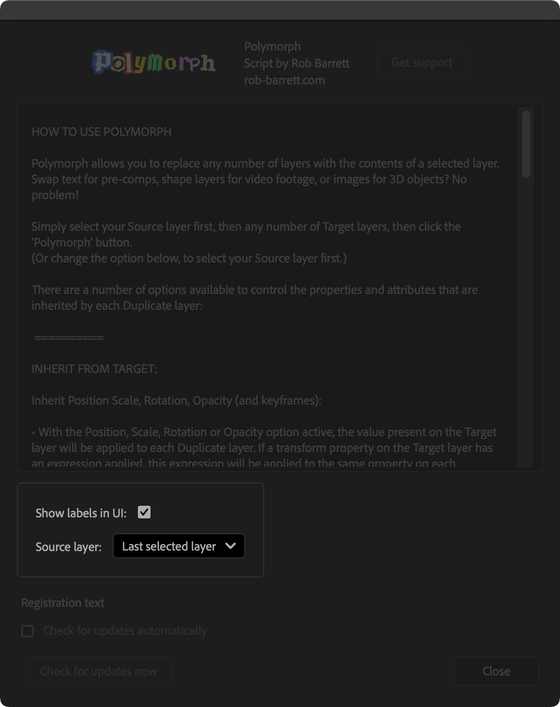

# How to Use Polymorph

**Polymorph allows you to replace any number of layers with the contents of a selected layer. Swap text for pre-comps, shape layers for video footage, or images for 3D objects? No problem!**

Simply select your Source layer first, then any number of Target layers, then click the 'Polymorph' button. (Or, optionally, select your Source layer last.)

There are a number of options available to control the properties and attributes that are inherited by each Duplicate layer.

------

## Inherit from Target

{width="500"}

### Inherit Position Scale, Rotation, Opacity (and keyframes)

* With the Position, Scale, Rotation or Opacity option active, the value present on the Target layer will be applied to each Duplicate layer. If a transform property on the Target layer has an expression applied, this expression will be applied to the same property on each Duplicate layer (depending on the 'Expressions' setting, shown below in this panel).
(The Target Position is always inherited. Deselecting this option disables inheritance of Target Position expressions.)

* With the keyframe option active (diamond icon), keyframes present on the Target layer will be copied to each Duplicate layer.

### Masks
When active, each Duplicate layer will inherit any masks set on the Source layer. Otherwise, each Duplicate layer will inherit any masks set on the Target layer.

### Other options
The Target layer's attribute(s) will be applied to each Duplicate layer.

------

## Inherit from Source

{width="500"}

### Inherit Scale, Rotation, Opacity:

The value present on the Source layer (at the current time) will modify the values applied to each Duplicate layer.

Example (with all transform property options active):

* Target layer has a Scale of 50%, Rotation of -10º and an Opacity of 80%.
* Source layer has a Scale of 50%, Rotation of 45º and an Opacity of 25%.
* Duplicate layer will have a Scale of 25%, Rotation of 35º and an Opacity of 20%.

------

## Other panel settings

{width="500"}

### Layer name of new layers

This determines how Duplicate layers will be named.
You can use the {source} and {target} tokens to insert the Source and Target layer names.

### Layer order of new layers

This determines if a replacement layer will be created above or below its target layer.

### Parenting of new layers

This determines the parent relationship between each Duplicate layer and its Target layer.

* Duplicate layer is parented to its Target
* Duplicate layer is parented to its Target's parent
* Duplicate layer is parented to its Target's duplicated parents (if the Target's parent is also a target layer)
* Duplicate layer is parented to the Source layer
* Target layer is parented to the Duplicate layer
* Chain: Duplicate layer is parented to its Target's parent; Target layer is parented to the Duplicate layer (this helps retain rigging chains, when deleting the Target layer)
* Duplicate layer is not parented.

### Visibility of Target layers

This determines if the Target layer is hidden, shown or deleted, or if the current visibility status is retained.

### Inherit track matte

* Each Duplicate layer will use the same track matte settings as its Target layer.
* Each Duplicate layer will use the same track matte settings as the Source layer.
* Each Duplicate layer will use the Target layer as its track matte.
* Each Duplicate layer will have no track matte set.

### Inherit expressions from Target or Source

This determines which expressions will be inherited on each Duplicate layer's transform properties.

* Keep Target expressions only:
Each Duplicate layer will only keep expressions from its Target layer.

* Keep Source expressions only:
Each Duplicate layer will only include expressions from the Source layer.

* Target expressions replace Source expressions:
Each Duplicate layer will include all expressions from its Target layer. If a Target layer property does not have an expression, but a Source layer property does, then this expression will be included.

* Source expressions replace Target expressions:
Each Duplicate layer will include all expressions from the Source layer. If a Source layer property does not have an expression, but a Target layer property does, then this expression will be included.

* Do not inherit expressions:
No expressions will be inherited from the Source or the Target layer. Any existing expressions on transform properties will be removed.

### Inherit 'Separate Dimensions' from Target or Source

This determines if the separation of the Position property on each Duplicate layer will match that of the Source layer or that of its Target layer.

### Delete Source layer

This determines if the Source layer is deleted after processing.

------

## Info panel settings

{width="500"}

### Show UI Labels

Select this to display text labels next to each of the icon buttons. Deselect this for a more compact, workspace-friendly layout. Polymorph must be restarted for this change to take effect.

### Source layer

Use this option to determine if your Source layer should be the first-selected or last-selected layer.